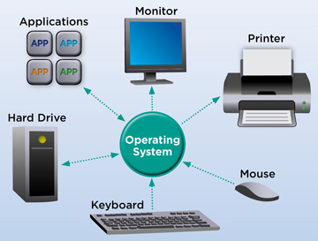

---
---

# Welcome ^_^
# Hello World!

# About Me

* My name is Maisy Rahmawati.
* I come from Pekalongan, Central Java.
* I am a student majoring in Information Systems 2018.
* Right now, I'm studying about the Operating Systems. So, this is the reason I made this github pages.

# About the Operating System

* Do You know or like about the Operating System? In My opinion, this course is very challenging and requires a lot of practice.
* For Me, it's not easy to learn about the Operating Systems. However, if We practice a lot and read from various sources, We will certainly be able to understand about the Operating System. So, I want to invite You to learn about the Operating System. You can visit the url link below. In this link, You can practice the Demos or read the information about the Operating System.
* [URLs](URLs/)

-- Maisy Rahmawati
-- OS201 maisyrahmawati
